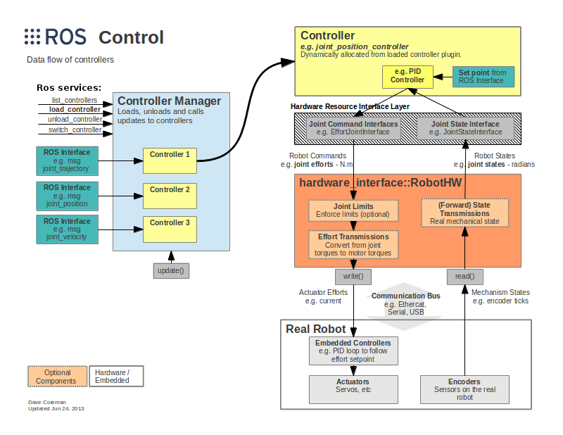
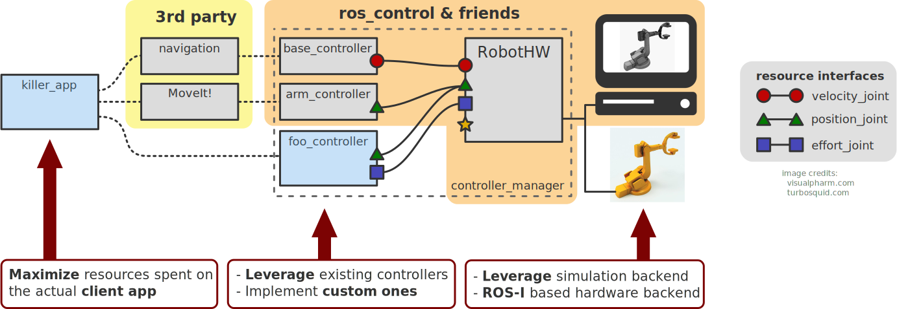
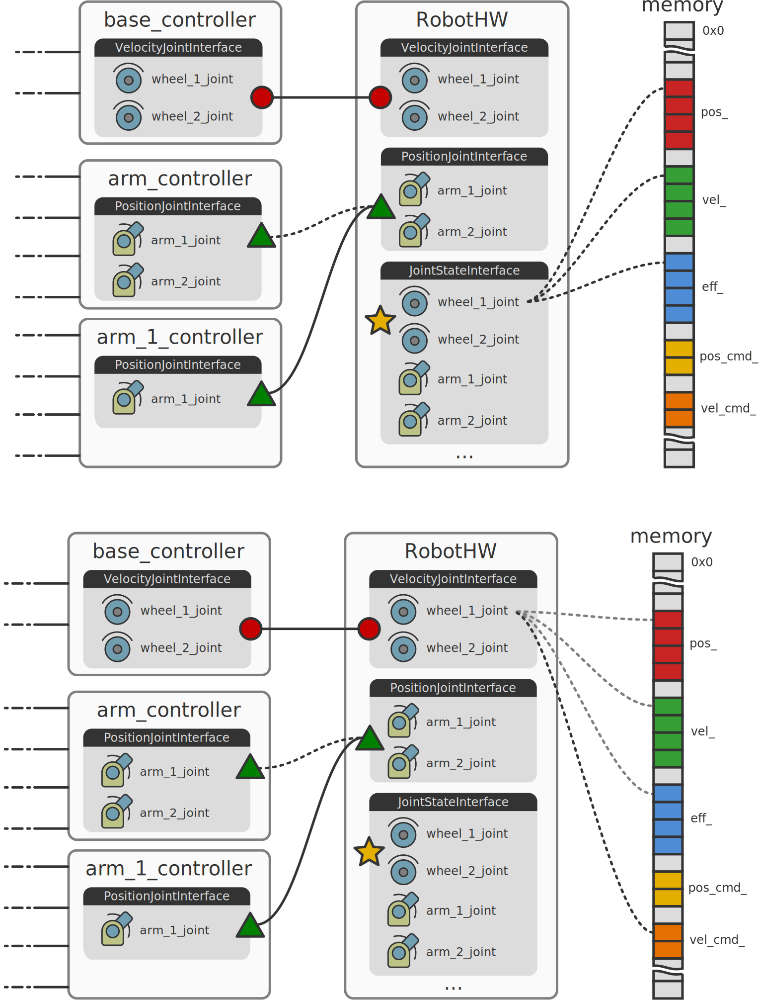
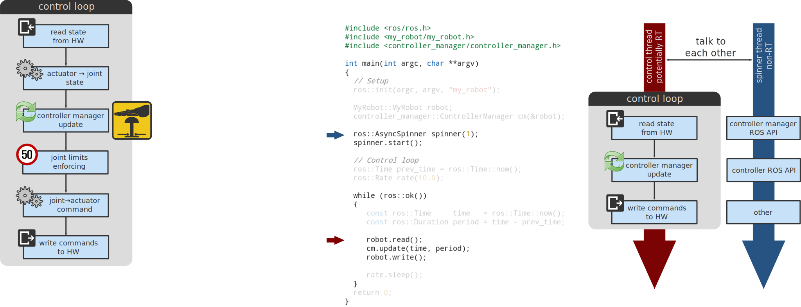
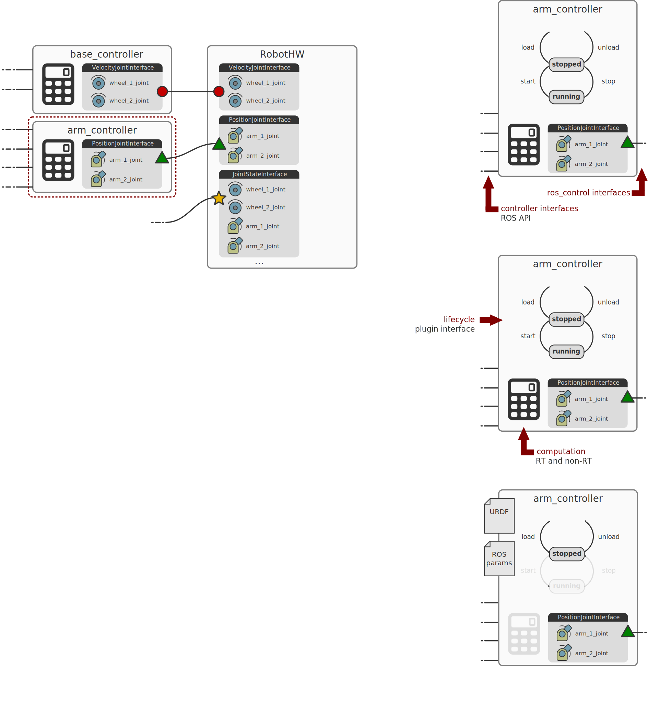

# Summary

In recent years the Robotics Operating System [@288] (ROS) has become the 'de facto' standard framework for the development of software in robotics. The idea of `ros_control` originates from the `pr2_controller_manager` framework with some ideas borrowed from OROCOS and serves for implementing and managing robot controllers with focus on both `real-time performance` and `sharing of controllers` in a robot-agnostic way. 
The clear, modular design of `ros_control` makes it ideal for both research and industrial use and has indeed seen many such applications to date. `ros_control` is out-of-the-box compatible with 3rd party software such as `MoveIt!` [@moveit],  the `ROS navigation stack`, Gazebo[@koenig2004design] and others.

The backbone of the framework is the Hardware Abstraction Layer, which serves as a bridge to different simulated and real robots. This abstraction is provided by the `hardware_interface::RobotHW` class, specific robot implementations have to inherit from this class.  Instances of this class are then used to interface the robot hardware (including some low-level sensors) to higher-level controllers. This allows higher-level controllers to be hardware-agnostic and easily shareable.

There is a possibility for composing already implemented `RobotHW` instances through the `CombinedRobotHW` class. The latter is ideal for constructing control systems for robots where parts come from different suppliers, each supplying their own specific `RobotHW` instance. The rest of the `hardware_interface` package defines read-only or read-write typed joint and actuator interfaces for abstracting hardware away. Through these typed interfaces this abstraction enables easy introspection and increases maintainability.

The `controller_manager` is responsible for managing the lifecycle of controllers, and hardware resources through the interfaces and handling resource conflicts between controllers. It provides a standard `ROS service`-based interface for controller lifecycle management and queries.

Furthermore, `ros_control` ships software libraries addressing real-time ROS communication, transmissions and joint limits. The `realtime_tools` library adds utility classes handling ROS communications in a realtime-safe way. The `transmission_interface` package supplies classes implementing joint- and actuator-space conversions such as: simple reducer, four-bar linkage and differential transmissions. A declarative definition of transmissions is supported directly within the robot's URDF[@garage2009universal].  The `joint_limits_interface` package contains data structures for representing joint limits, methods to populate them through URDF or yaml files and methods to enforce these limits. `control_toolbox` offers components useful when writing controllers: a PID controller class, smoothers, sine-wave and noise generators. 

The repository `ros_controllers` holds several ready-made controllers supporting the most common use-cases for manipulators, mobile and humanoid robots, e.g. a `joint_trajectory_controller` is heavily used with position-controlled robots to interface with MoveIt!.

Finally, `control_msgs` provides ROS messages used in most controllers offered in `ros_controllers`.

`ros_control` was conceptualized by Sachin Chitta at Willow Garage Inc. and initial design and implementation was done by Sachin Chitta (then at Willow Garage), Wim Meussen, Vijay Pradeep and Eitan Marder-Epstein (then at HiDOF) before being released open-source.

`ros_control` is released as binary packages with each new version of ROS, source code is hosted at the [ros-controls](https://github.com/ros-controls) Github organization.

# Robots using `ros_control`

Being a mature framework, `ros_control` is widely applied to both production and research platform robots. A few examples where the control system is implemented with `ros_control` are:
- PAL Robotics' humanoid, biped and mobile robots: REEM, REEM-C, PMB2, Tiago and Talos [@stasse2017talos] 
- NASA's humanoid and biped robots: Valkyrie & Robonaut [@hart2014robot, @badger2016ros]
- Universal Robots' industrial arms: UR3, UR5 [@andersen2015optimizing]
- Clearpath Robotics' outdoor mobile robots: Husky, Jackal [@cpr_roscontrol]
- Shadow Robot's anthropomorphic, highly sensorized and precise Shadow Hand [@meier2016distinguishing]
- The quadruped robot HyQ-Real[@hyqreal] at Istituto Italiano di Tecnologia
- The "Twil" robot at Federal University of Rio Grande do Sul [@lages2017parametric]

# Figures for overview

The figures below highlight parts of the system in more detail and were made originally for the ROSCon2014 talk [@roscon_adolfo]. 

